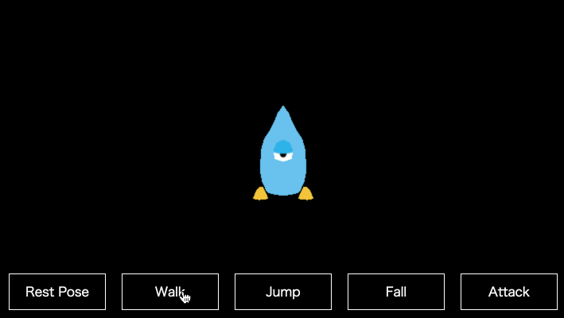

# Utsuroi

The plugin makes it easy to control model animation when use Three.js :)

[](LICENSE)



### Setup

#### NPM Install

```bash
$ npm install utsuroi
```

#### Script Install

```html
<script src="utsuroi.js"></script>
```

### Basic Usage Example

```javascript
// esm
import { Manipulator } from './manipulator'

let manipulator: Manipulator | undefined;
// Load asset
var loader = new THREE.GLTFLoader();
loader.load('assets/model.gltf', (gltf) {
  // Add scene
  scene.add(gltf.scene)

  // Create Manipulator
  // new Manipulator(THREE.Scene, THREE.AnimationClip[])
  manipulator = new Manipulator(gltf.scene, gltf.animations);

  // start motion
  // manipulator.play(actionName, loop)
  manipulator.play('Rest Pose', true);
});
```

#### How to update animation

Execute the `update` method every frame.

```javascript
function tick() {
  requestAnimationFrame(tick);
  if(manipulator) {
    manipulator.update();
  }
}

tick();
```

#### How to change action

If you want to change the action, simply pass the action name, loop and duration to the `to` method and execute it :)

```javascript
// to(ActionName[, duration, loop])
manipulator.to('Walk', 300, true);
```

#### How to pause animation

```javascript
manipulator.pause();
```
