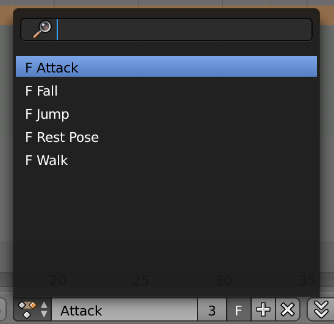

# Utsuroi


[](LICENSE)

This is a plug-in for easy switching animation of blender models in Three.js.

### Setup

#### NPM Install

```bash
$ npm install utsuroi
```

#### Script Install

```html
<script src="utsuroi.js"></script>
```

### Basic Usage Example

First, export model data with animation attached with A with json.
You will use the name you set at this time later :)



#### How to create

Let's create an utsuroi object using the loaded model data.

```javascript
var utsuroi;

// Load asset
var loader = new THREE.JSONLoader();
loader.load('assets/model.json', (geometry, materials) {

  // Allow "skining" for all materials.
  materials.forEach(function(material) { material.skinning = true; });

  // Mesh
  var actor = new THREE.SkinnedMesh(geometry, materials);
  scene.add(actor);

  // Create Utsuroi
  // new Utsuroi(SkinnedMesh, defaultActionName)
  utsuroi = new Utsuroi(actor, 'Rest Pose');

  // start motion
  utsuroi.play();
});
```

#### How to update animation

Execute the `update` method every frame.

```javascript
function tick() {
  requestAnimationFrame(tick);
  if(utsuroi) {
    utsuroi.update();
  }
}

tick();
```

#### How to change action

If you want to change the action, simply pass the action name, loop and duration (default: 200) to the `to` method and execute it :)

```javascript
// to(ActionName[, loop ,duration])
utsuroi.to('Walk', true, 300);
```

#### How to pause animation

```
utsuroi.pause();
```
